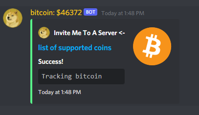
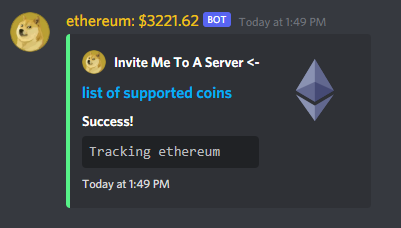

# CryptoCurrency Discord Bot 

 wow

## Local Build
```
npm install
npm run build
npm run start
```

## Discord Commands
```js
$track <coin id>
// example: $track bitcoin
```

The bot will then save your server choice and update its own nickname periodically as the desired cryptocurrency changes in price

